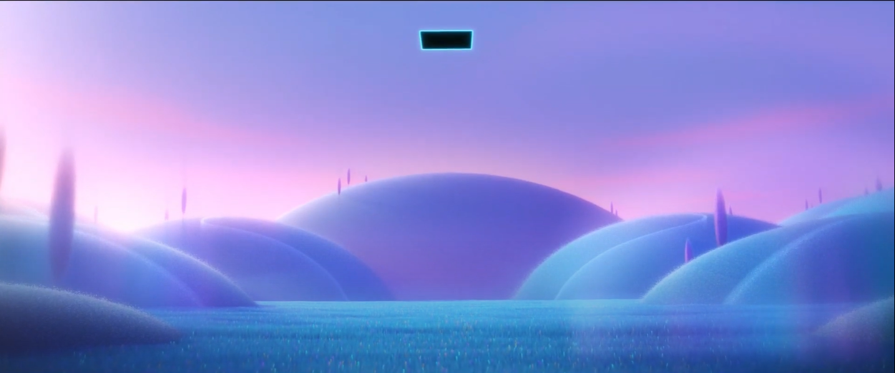
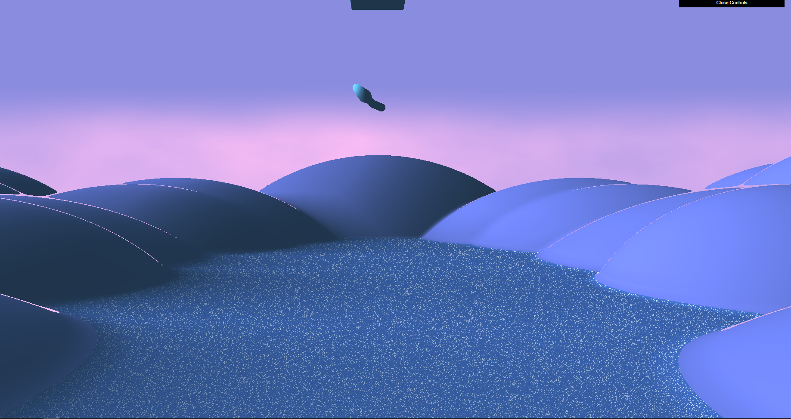

Name: Benjamin Sei
pennkey: bensei

Citations:

https://www.iquilezles.org/www/articles/distfunctions/distfunctions.htm 

https://www.iquilezles.org/www/articles/rmshadows/rmshadows.htm https://www.shadertoy.com/view/7stSW7

Inspiration:

https://youtu.be/c1AyM118JbU 0:38

This is an sdf scene rendered by ray marching. The scene is based on the movie Soul where Joe is falling into the Great Before. Here, we see many hills which form the core theme of the ground environment. There is a portal in the sky where Joe falls from, where a simple model of Joe falls down into the grass below. The position of the model is based on a quadratic function of time. The model also slowly rotates counterclockwise to emulate Joe's fall. The grass which makes up the ground should look like fuzzy grass, but it's current representation uses noise to create white specks in order to simulate the white tipped blades of grass in the scene. There core light shining from the left of the scene to the right, and the hills cast soft shadows by a shadow feeler ray. Note that only certain objects cast shadows (e.g not Joe and the portal) since it is only the environment that casts the shadows in the scene. There is also a cool light and ambient light to add more coloring to the scene. The sky is colored using noise based on fbm and the y position as input.

