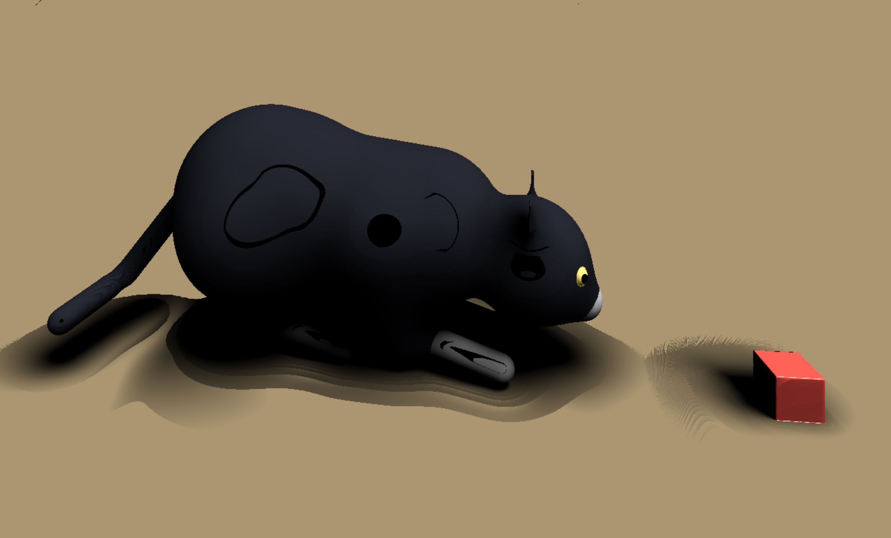
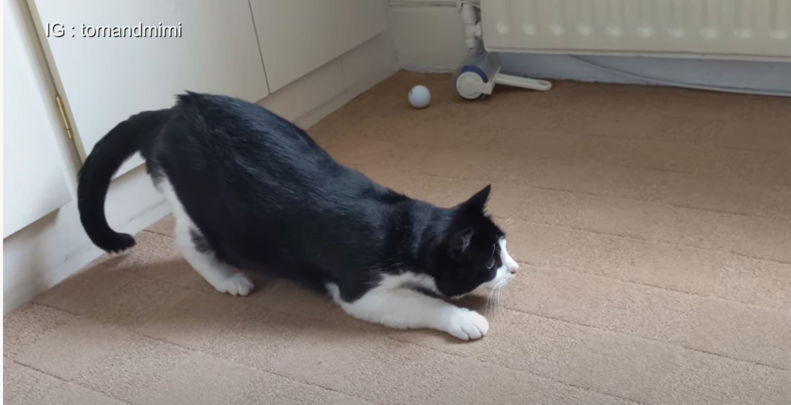

Name: Effie Li/
Pennkey:effieli/
Citation: https://www.iquilezles.org/www/articles/distfunctions/distfunctions.htm /
Link:   https://effieyanfei.github.io/hw03-advanced-raymarching/ /

The reference is a video clip: https://www.youtube.com/watch?v=E4CqPoToV4Q&ab_channel=Tom%26Mimi
I created a ready-to-bounce cat wiggling its butt at a animated box. The cat is created with a combination of shapes including sphere, cone and capsule. I used both sin and cos, as well as triangle wave to animate the cat. The cat's butt and thighs move side to side, and slightly up and down. The box is created with a box sdf, and it is animated using sin and a parabola funtion. 
To color the cat, I added a variable type that gets updated during SDF. The cat is lambert and has two colors. The box has one color and uses blinn phong. The floor is one color and is also lambert. To shortedn the runtime, I used a bounding box when computing SDF, so that the cat and the box can be computed faster. There are three lights in the scene, and only one of them casts shadows. 

