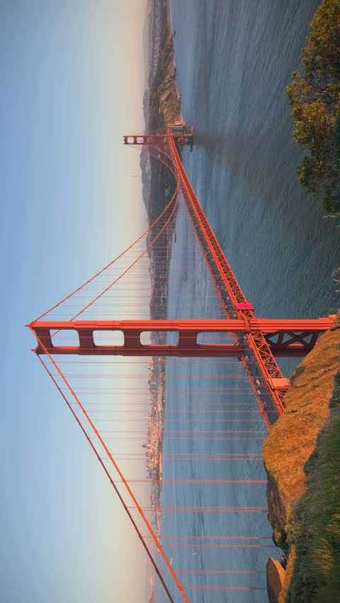
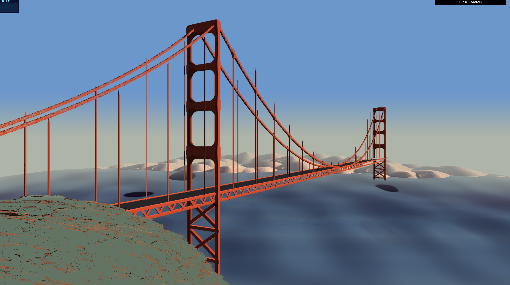
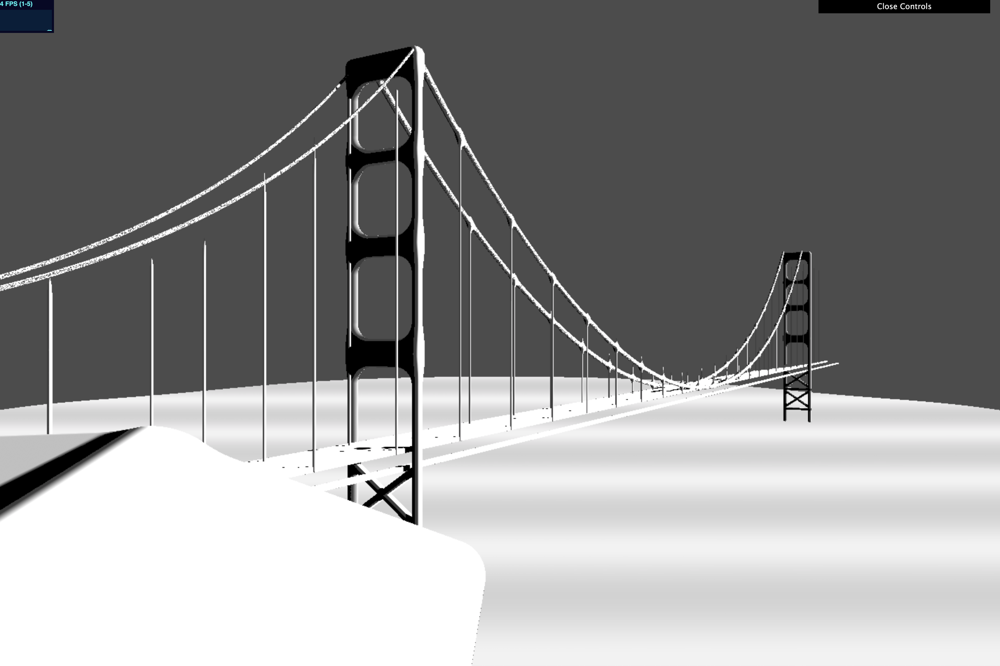
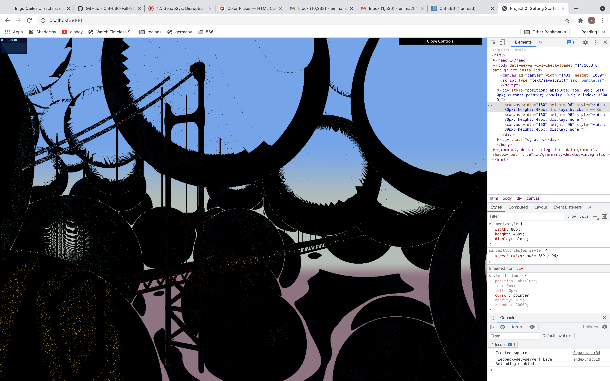
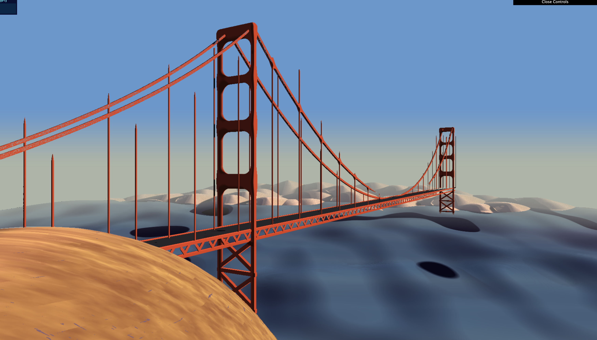

# CIS 566 Homework 2: Implicit Surfaces
Emma Holthouser
PennKey Emma20

I chose to create an sdf scene based off an image of the golden gate bridge. I used a myraid of different sdf functions and used smooth union, or smin in my code for my front rocks and on my cables. The water under the bridge is animated and I used toolbox functions include, cosine, mix, and Ease in quadratic. I am using noises for the background city, the grassy hill in the front and the color on the water as well as the animation of the water. Worley noise is being used to add color variation to the water and it is currently being animated. The motion of the water is also animated with the use of perlin noise offsetting the y axis of the height field

For optimizzation I seem to be getting a wide variety of fps depending on when I open the project. I am currently using bounding boxes for every major aspect of the scene, as well as a max ray depth. Unfortunately my scene takes up a lot of space especially on the z axis so the max z is pretty hight. I am also using repetition to try and improve the fps. I am repeating the main edge of the bridge as well as all of the bridge poles. 

I am using a lambert shader for most of the material but applied some specular highlights to the water. I am using fbm to add color variation to the city in the back the rock in the front and the water. The water, city, bridge, road, rock, and background sky are all different materials. 

The scene has a 3 point light system with the main key light in the top right of the scene with a yellow tint. The fill light is on the left side of the scene and is more a blue tint to fill in the shadows. The third rim light is more toward the back of the scene in order to add more ambient light. 

Reference Image
-----------

Final 
--------

Part 1
---------

Fun Bloopers
-----------

wooden rock

my live link is https://emmaholthouser16.github.io/hw02-raymarching-sdfs/ but I am having trouble getting it to sync at the moment
# CIS 566 Homework 3: Advanced Raymarched Scenes

## Objective
- Gain experience with signed distance functions
- Experiment with animation curves
- Create a presentable portfolio piece

## Base Code

You will copy your implementation of hw02 into your hw03 repository.

## Assignment Requirements
- __(35 points) Artwork Replication__ Your raymarched scene should attempt to replicate the appearance of your inspiration (include picture) with clear effort put into the replication.
- __(25 points) Materials__ Your scene should be composed of at least three different materials. We define a material to be a surface reflection model combined with some base surface color; texturing is optional.
- __(10 points) Lighting and Shadows__ Light your scene with at least three light sources. At least one of your light sources must cast shadows, and they should be soft shadows using the penumbra shadows algorithm we discussed in class. Consider following the "Key Light, Fill Light, GI Light" formulation from the in-class example.
- __(20 points) Performance__ The frame rate of your scene must be at least 10FPS.
- __(10 points)__ Following the specifications listed
[here](https://github.com/pjcozzi/Articles/blob/master/CIS565/GitHubRepo/README.md),
create your own README.md, renaming this file to INSTRUCTIONS.md. Don't worry
about discussing runtime optimization for this project. Make sure your
README contains the following information:
  - Your name and PennKey
  - Citation of any external resources you found helpful when implementing this
  assignment.
  - A link to your live github.io demo
  - An explanation of the techniques you used to model and animate your scene.

## Useful Links
- [IQ's Article on SDFs](http://www.iquilezles.org/www/articles/distfunctions/distfunctions.htm)
- [IQ's Article on Smooth Blending](http://www.iquilezles.org/www/articles/smin/smin.htm)
- [IQ's Article on Useful Functions](http://www.iquilezles.org/www/articles/functions/functions.htm)
- [Breakdown of Rendering an SDF Scene](http://www.iquilezles.org/www/material/nvscene2008/rwwtt.pdf)
