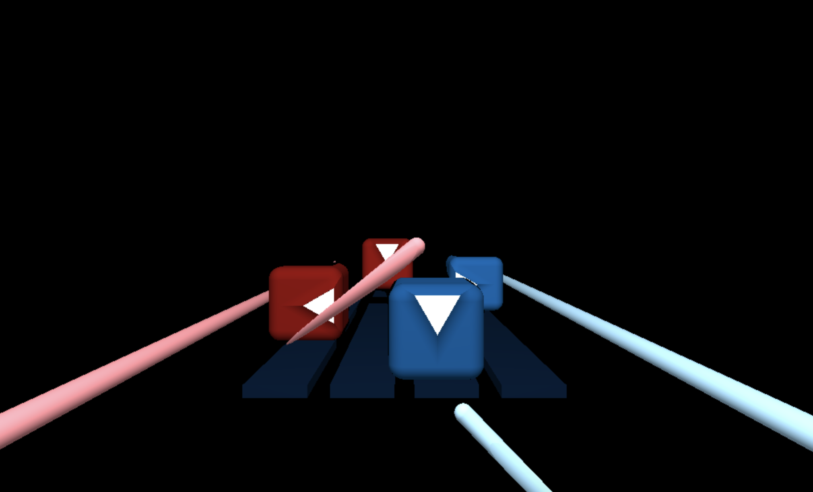
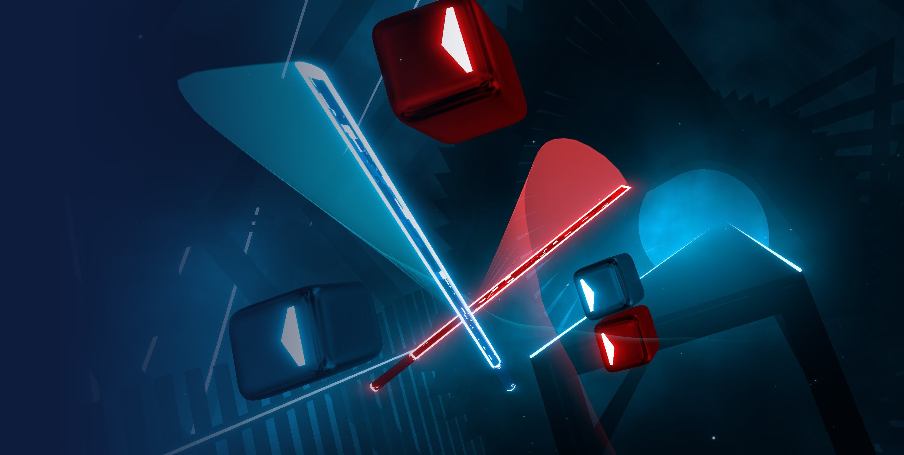

# CIS 566 Homework 3: Advanced Raymarched Scenes

## Objective

- Gain experience with signed distance functions
- Experiment with animation curves

## Techniques

part0.5: 

- casted rays from a virtual camera
- tested the ray casting function by converting ray directions to colors using the formula `color = 0.5 * (dir + vec3(1.0, 1.0, 1.0))`

part1: 

- Used SDF smoothunion and intersection to make beat cubes and light sabers
- Used ease-in, sin, and cos functions to control the animations

part2:

- assigned different material color, lambert and blinn shading, and noise textures to the objects in the scene
- lighted the scene with three light sources, with one that casted soft shadows using the penumbra shadows algorithm
- computed Depth of field with focal length and range  

inspiration: 

## General Information

Name: Amelia Peng

PennKey: pqy

Live Demo: https://ameliapqy.github.io/hw03-advanced-raymarching/

Resources:

- https://www.iquilezles.org/www/articles/distfunctions/distfunctions.htm
- https://www.iquilezles.org/www/articles/smin/smin.htm
- https://www.shadertoy.com/view/fsdXzM
- https://www.shadertoy.com/view/3s3GDn
