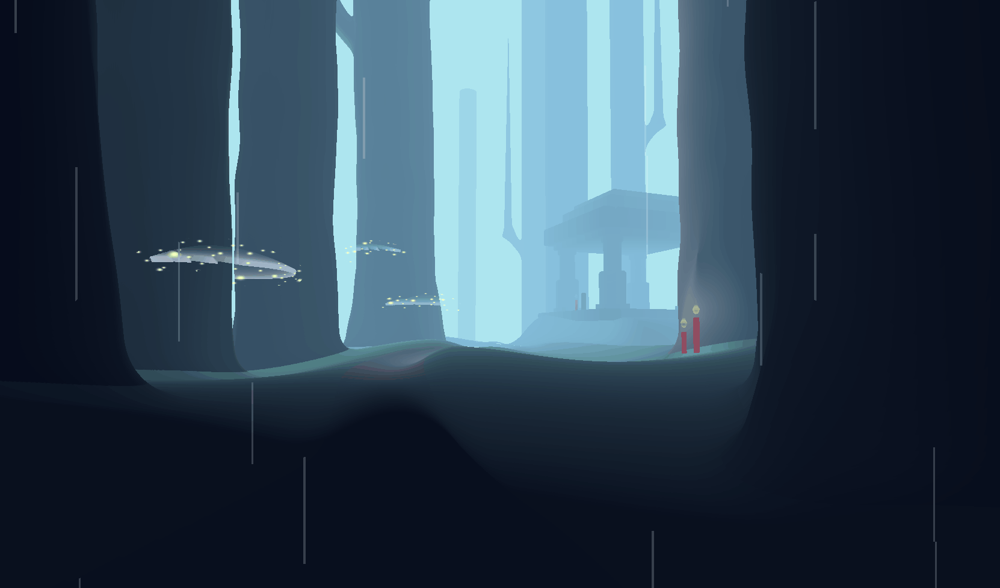
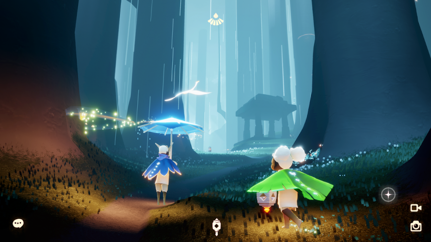
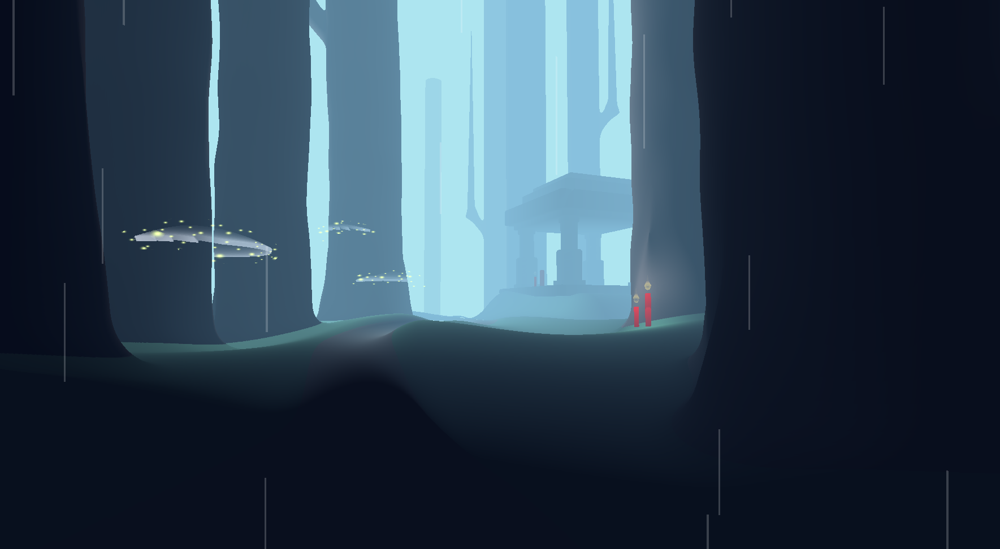
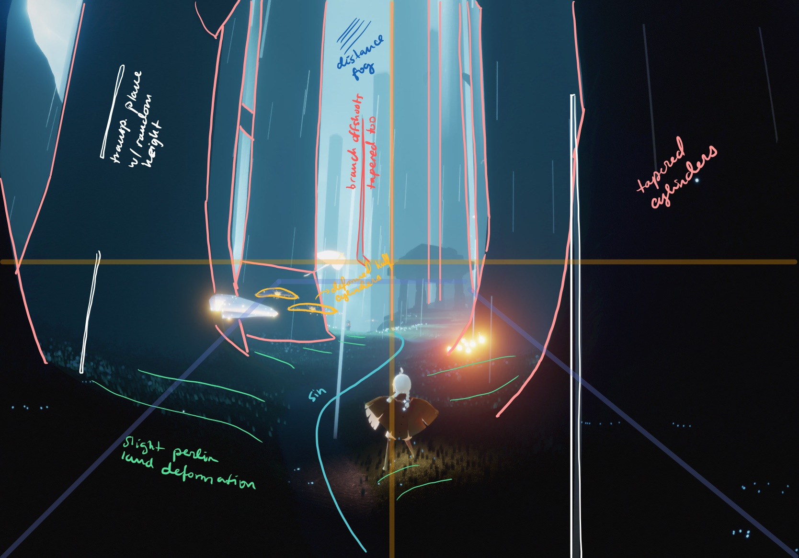
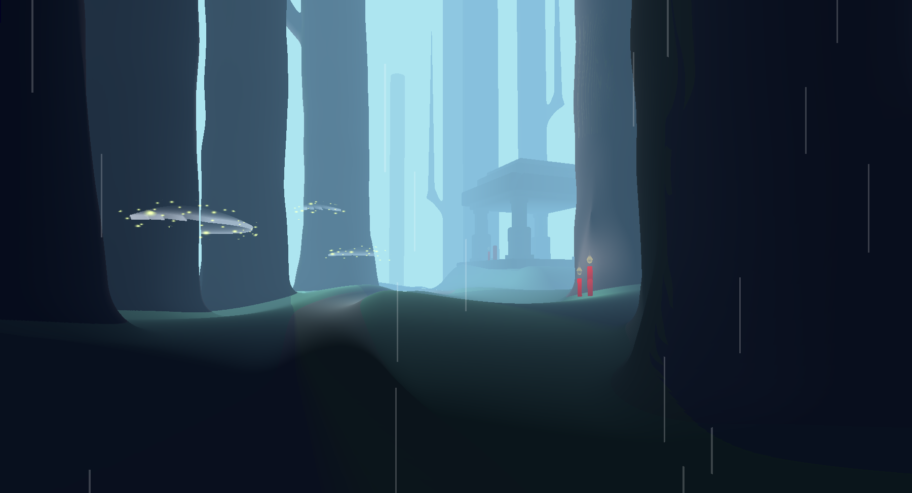
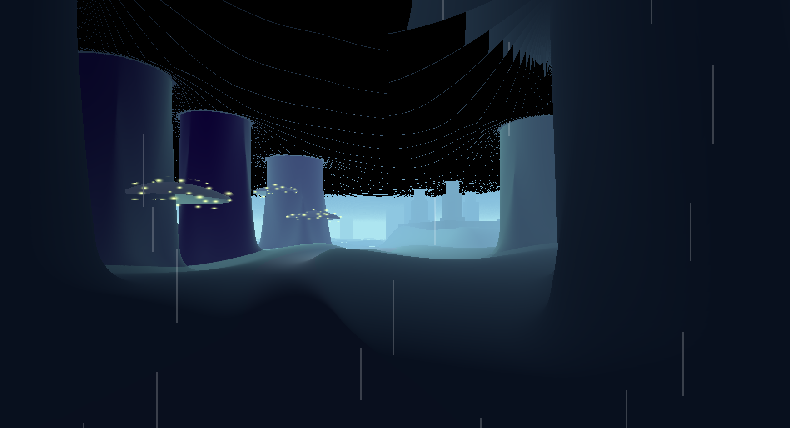
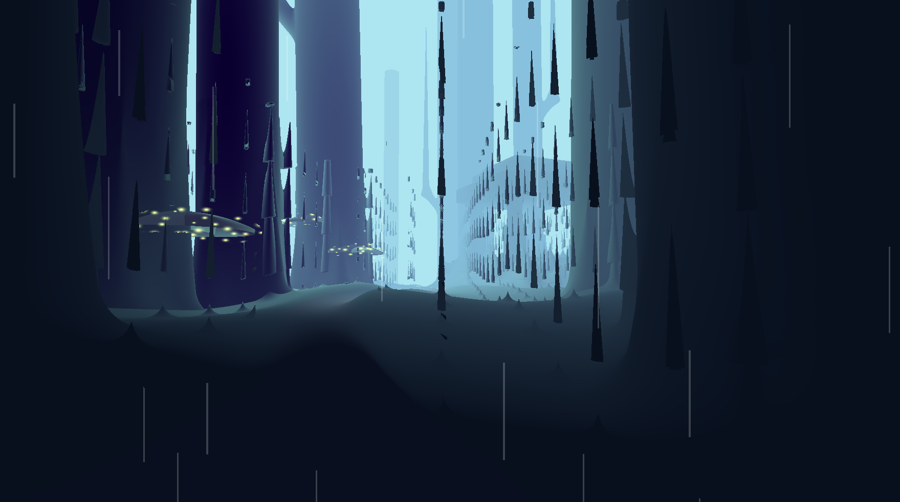
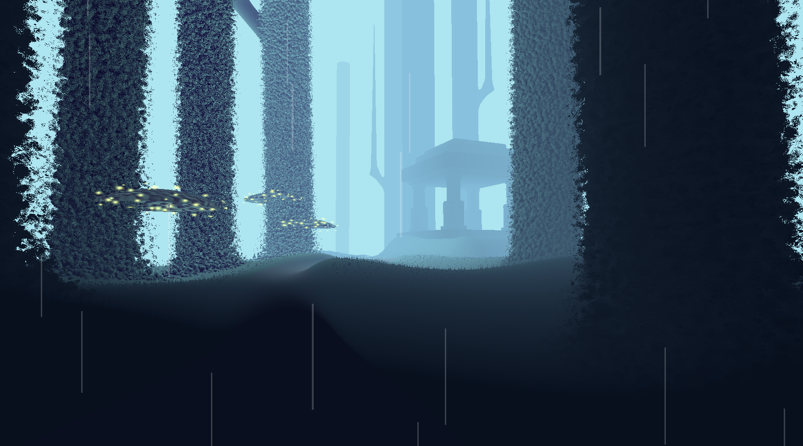
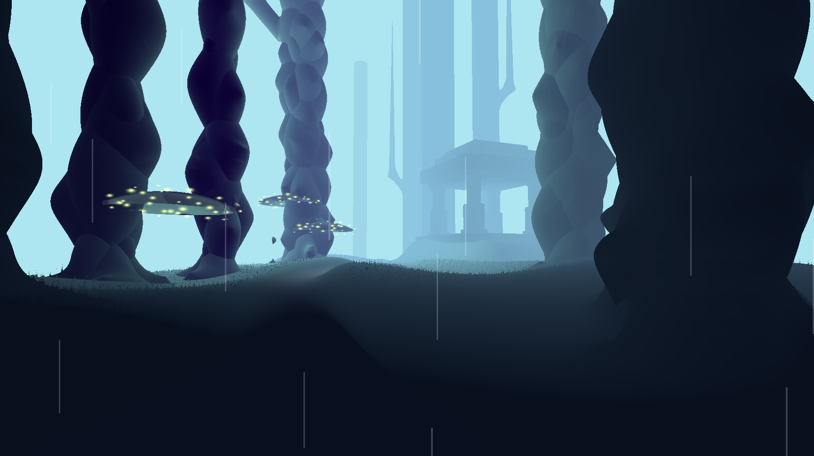

# CIS 566 Homework 3: Implicit Surfaces

- Author: Ashley Alexander-Lee
- PennKey: asalexan
- [Live Demo](https://asalexan.github.io/hw03-advanced-raymarching/)

In this project, I aimed to create a raymarched scene, replicating a screenshot from Sky: Children of Light by thatgamecompany.

| Reference | Replication |
| --------- | ----------- |
|  |  |

Demo / Installation
===================
Live demo: https://asalexan.github.io/hw02-raymarching-sdfs/

To run locally:
1. Clone this repo
2. run `npm i`
3. run `npm start`

Process
======
I first started with a markup of the screenshot I wanted to replicate, which you can see below:

In order to produce the initial geometry and lambertian shading, I added the following elements:
- **Forest SDF:** I created a ForestSDF, which places trees (composed of TreeSDFs) in the scene given a list of Tree structs with varying positions, radii, and heights. The trees themselves are cylinders smoothblended with cones at the bases. The trees are deformed slightly with perlin noise to make the shapes look more natural. 
- **Temple SDF:** The TempleSDF is composed of columns, a base, and a roof. There is one ColumnSDF, which is reflected across the x and z axes by taking the absolute value of the input point, creating four symmetric columns. The rest of the temple is built out of rounded box SDFs. 
- **Terrain Height Field:** I created a function f(x, z) that returns a height to be compared against the query point y. The ground is deformed with perlin noise to create hills, and the path is just a sine wave. If the query point resides close to or inside the path in the x direction, it's colored appropriately, and the height is interpolated down to a flat terrain height.  
- **Distance Fog:** There are two different color interpolations done according to z-distance. The first (closest) is interpolation between the lambert color and the blue fog color. The second, for farther objects, is interpolation between alpha 1.0 and alpha 0.0 to simulate objects fading into the distance.

I added some additional elements for this iteration of the project:
- **Candle SDF** - I added candles to the scene by creating a candleSDF, which is composed of a cylindrical base and a smoothblended flame. Much like the trees, I created a Candle struct that holds information like: position, height, radius, light radius, and whether the candle is off or on. I color the flame using the "Transparency Technique" I describe in the next section.
- **Mushroom SDF** - The mushroomSDF defines the signed distance field for the sake of sphere marching, *not* for material matching. The color of the magical mushroom is determined by my transparency trick, described later. I add sparkles as a post-processing effect, and I set a flag, isMushroom, to determine whether the post-process effect is applied to a particular location. The sparkle size is randomized according to the nearest Worley cell center.
- **Branch SDF** - I added a few angular branches to match the reference,and the branchSDF is composed of a smoothblended cylinder for the base and cone for the branch.
- **Soft Shadows** - I implemented penumbra shadows, but was not happy with the aesthetic effect. Here is a screenshot of the result:

Transparency Technique
======================
To achieve semi-transparency for the candle flame and mushroom tops, I had to get a little creative. If the ray hits a mushroom (or candle flame), it sets a flag and *does not* update the minimum SDF, allowing the ray to continue on and hit the object behind it. If the ray does not hit a mushroom, the minimum SDF is calculated as usual, which is important to continue the sphere marching process. 

I also keep track of a distance from the center of the mushroom for interpolation later. To do this, I first have to check if the mushroom has been hit before. If it hasn't, it updates the distance. This distance is later used to interpolate between complete transparency (in the middle of the mushroom) to mushroom color (on the rims of the mushrooms).

Resources
===========
I used the following resources as reference:

[SDFs, SDF Symmetry](https://www.iquilezles.org/www/articles/distfunctions/distfunctions.htm)

[Height Fields](https://www.iquilezles.org/www/articles/terrainmarching/terrainmarching.htm)

Bloopers
========

#### Backwards Bounding Height

#### Raining Infinite Grass

#### Impressionist Trees

#### Underwater Forest

