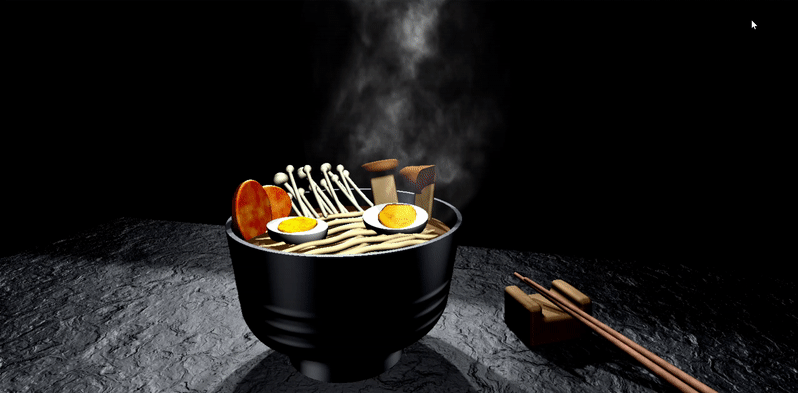
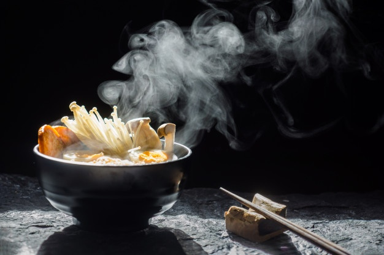
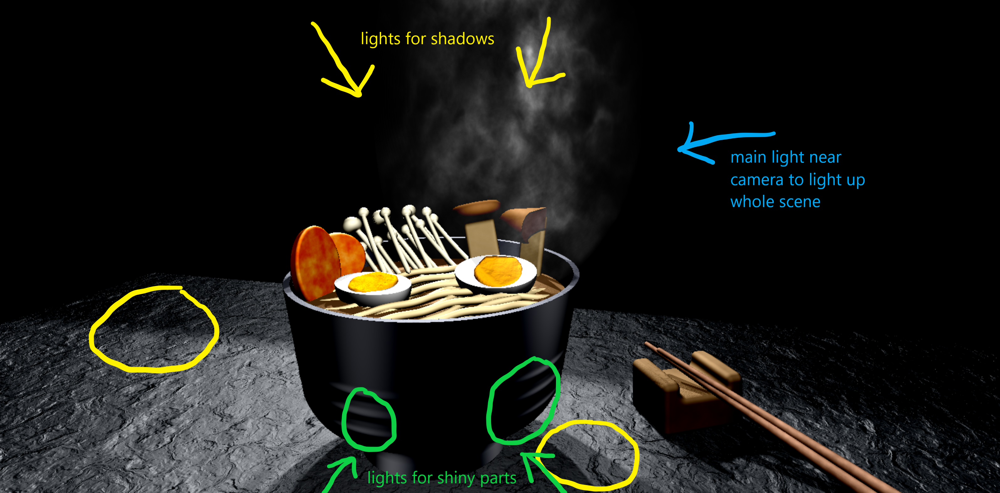

# CIS 566 Homework 3: Advanced Raymarched Scenes
Sharon Dong (PennKey: sharondo)

Live demo: https://sharond106.github.io/hw03-advanced-raymarching/

Reference image:

 

## Techniques
### Models and animation
I created this scene using ray marched sign distance functions. Here are some more details about the more involved objects:

- **Enoki mushrooms** - smooth blend operation of the mushroom cap and stem using finite reptition, 
and 3 varying rows of mushrooms are placed on top of each other
- **Noodles** - 2 layers of rounded cylinders with finite repetition, where the x and z positions are offsetted with cosine functions to appear wavy
- **Bowl** - "onioning" operation from IQ's blog of a capped cone cut in half
- **Smoke** - warped 3D fbm noise within a sphere using a smoother step function for interpolation and a gain function on the x position to make the smoke near the left and right sides of the sphere fade out, animated to flow from left --> right, bottom --> top, and colored by changing the alpha value so you can see through it

Helpful links:
- https://www.iquilezles.org/www/articles/distfunctions/distfunctions.htm
- https://iquilezles.org/www/articles/warp/warp.htm
### Materials 
Most objects in my scene use lambert shading from multiple light sources, and extra work was required for the following:
- **Table** - blinn phong shading and textured by offsetting normals using warped fbm noise (offsetting normals only helped a lot with performance)
- **Bowl** - blinn phong using specific light sources for the shiny spots and created ridges by offseting the result of the sdf with a sin function based on y position
- **Egg yolks** - textured by offseting vertices using fbm noise
- **Sausages and Chopsticks** - used fbm noise for coloring
- **Larger mushrooms** - onioning technique on the mushroom cap so the outer layer could be colored dark brown

### Lighting and shadows

I have 5 different light sources: 2 for shadows, 2 for shiny parts on the bowl, and 1 for overall lightness in the scene. 

I am using gamma color correction coefficient of .72 and increasing the contrast using the technique from here: https://www.shadertoy.com/view/3sjGz3

For the rectangular shadow in the back, I placed a floating box out of sight
