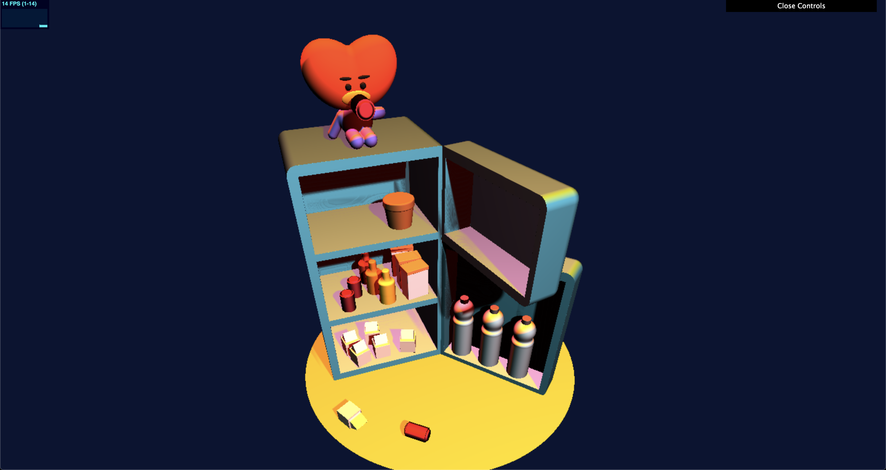
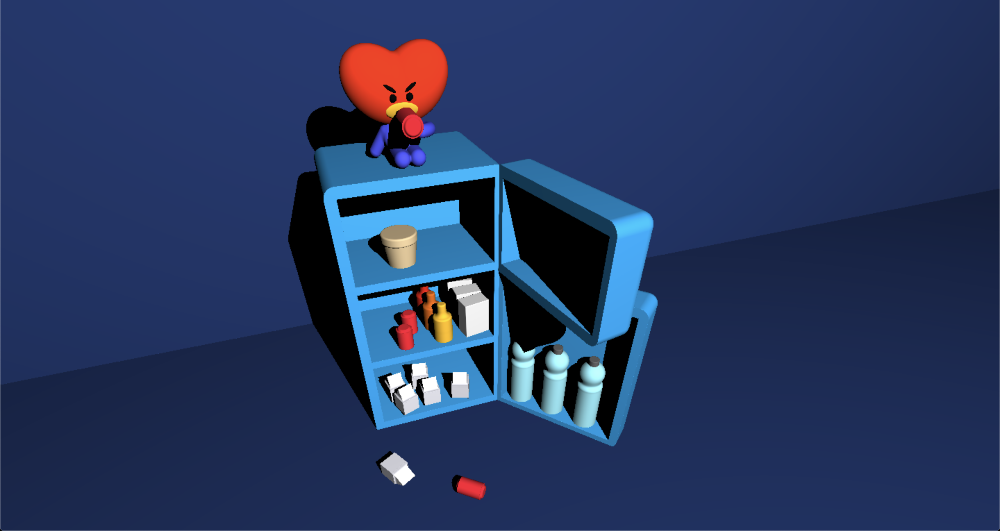
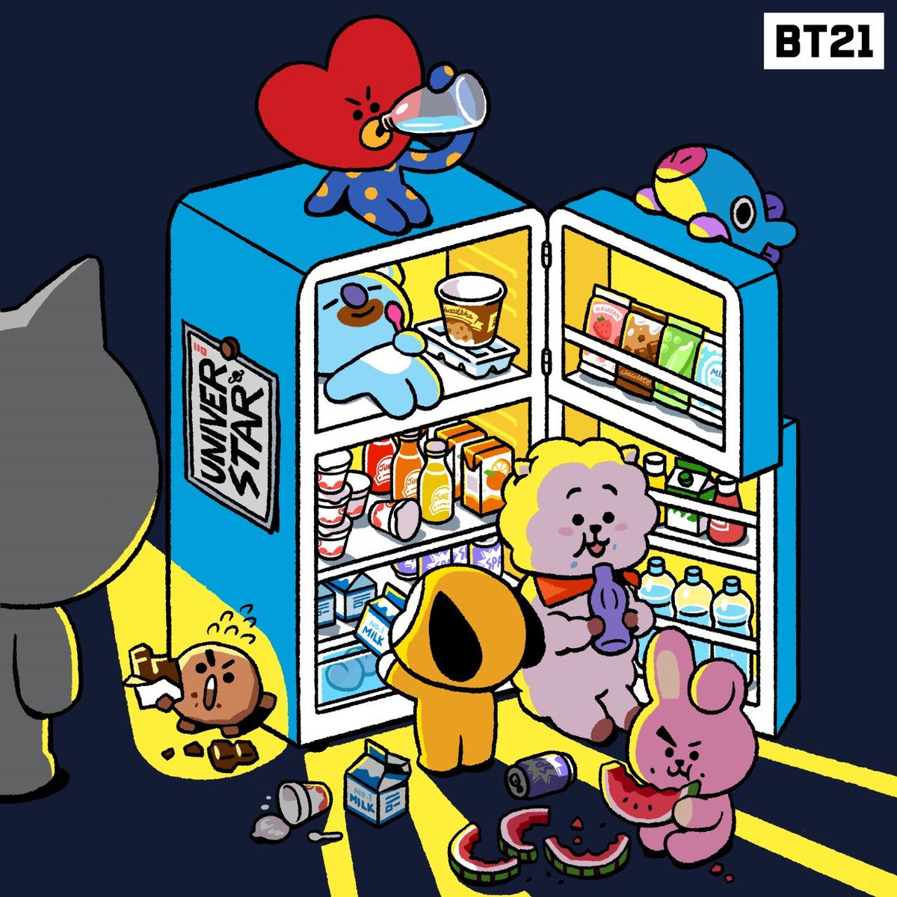

# CIS 566 Homework 2: Implicit Surfaces

Linda Ting (lstting)

## Introduction
This project uses ray marching and signed distance functions to create a scene referenced from [here](https://twitter.com/bt21_/status/1151054299952119810). Live demo available [here](https://linda-ting.github.io/hw02-raymarching-sdfs/).

SDF functions & operations referenced from [IQ](https://www.iquilezles.org/www/articles/distfunctions/distfunctions.htm)

## Lighting

## Geometry

## Reference

Lambertian and Blinn-Phong surface reflection models are used to mimic various materials throughout the scene. The scene has three light sources and uses gamma color correction.

The refridgerator was created by subtracting geometry from some basic rounded boxes. The various items found in the refridgerator were created from unions of various geometry. To make them easily repeated, each piece (i.e. one milk box) can be generated using a helper function. Tata (the character sitting on top of the fridge), has an animated facial expression and arm to allow him to drink from a can of soda. These animations are controlled by a parabolic impulse function and an easing function, respectively. 