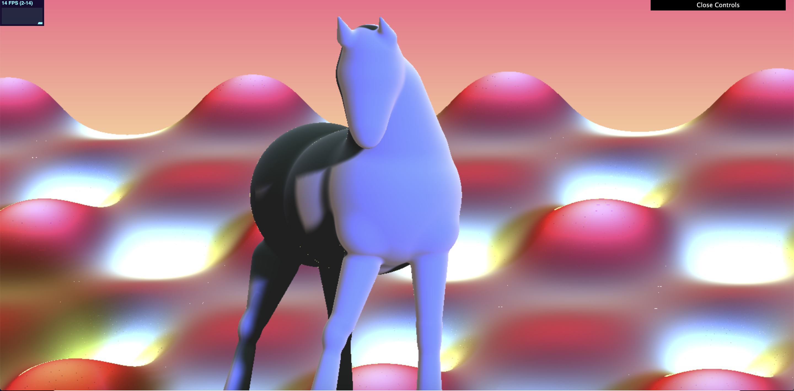
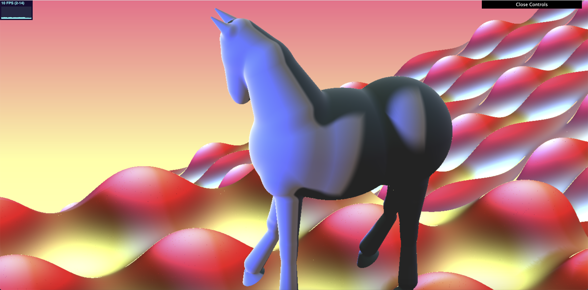
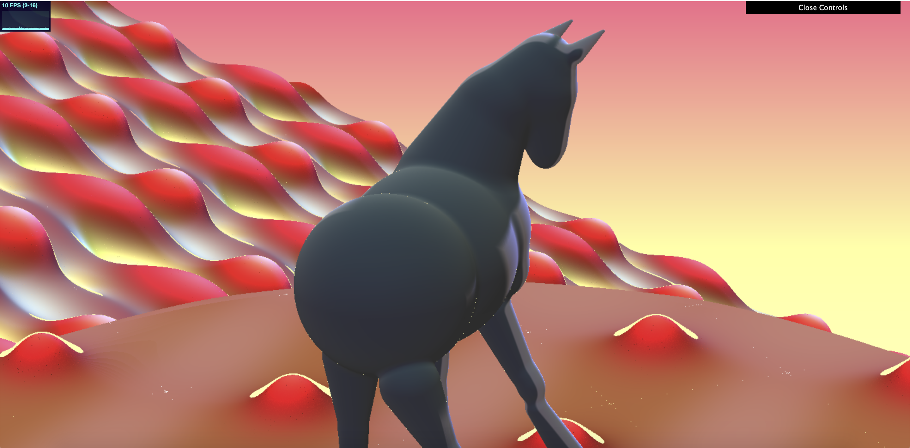
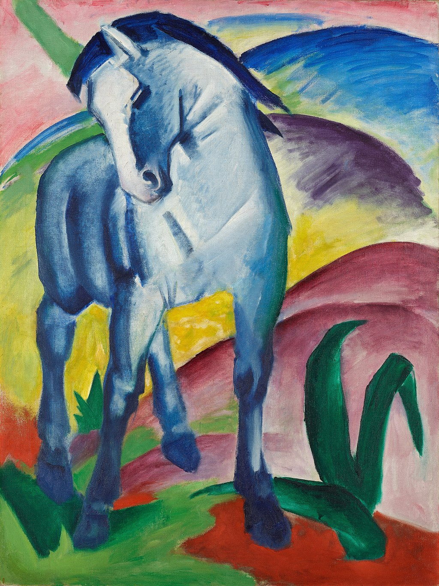

# CIS 566 Homework 3: Advanced Raymarched Scenes
By Meggie Cheng (PennKey: meggie)

## Result
Link to live demo: https://tauntybird.github.io/hw03-advanced-raymarching/

Final render from default front view:

View of displaced, angled plane from another side:

View of platform below horse that is part of bounding sphere:

## Explanation
- For the model, I utilized many sphere, ellipsoid, round cone, and capped cone SDFs. I also used a plane SDF with displacement for the background hills. The horse's SDFs are all smooth min'd together, and many of the parts are reused and translated by an offset (notably the legs but also the ears, and chest and hindquarters). I used a velvet surface shader (link in helpful resources section) to make the horse look soft/fuzzy.
- There are three lights in the scene: one from the front that casts the main soft shadows, one from the back that casts a weaker "global illumination" light, and one from the top that casts a mild sunset sky light.
- The horse uses a velvet surface reflection model and the hills use a lambert refleciton model. The hills are multicolored to represent different materials depending on its depth of displacement.
- For optimization, I used a bounding sphere for rendering the horse and the platform it stands on. I used a bounding limit to the z value of the queryPos in order to better and more quickly render the displaced plane in the background (before it had weird warped results and it was really slow).
- For the animation, I animated the background (rolling hills). Time and space are both displaced by sin and cos functions, and the rate at which the time is displaced is further modified with a quadratic easing function. The color is also modified according to this displacement function. To mimic the multicolored hills in the artwork I made the valleys yellow/white and the tops red/blue. 

## Reference art
Blue Horse I by Franz Marc

(https://en.wikipedia.org/wiki/Blue_Horse_I)

## Helpful resources
- IQ's SDF functions: https://www.iquilezles.org/www/articles/distfunctions/distfunctions.htm
- IQ's shadertoy, Mike: https://www.shadertoy.com/view/MsXGWr
- IQ's soft shadows: https://www.iquilezles.org/www/articles/rmshadows/rmshadows.htm
- Velvet surface shader: https://www.indigorenderer.com/forum/viewtopic.php?t=6800