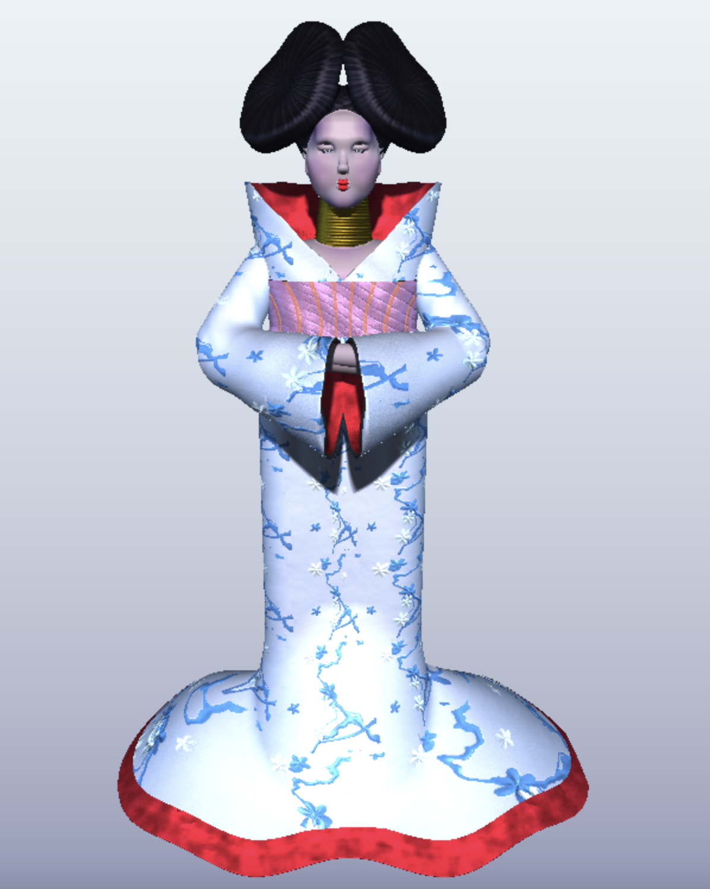
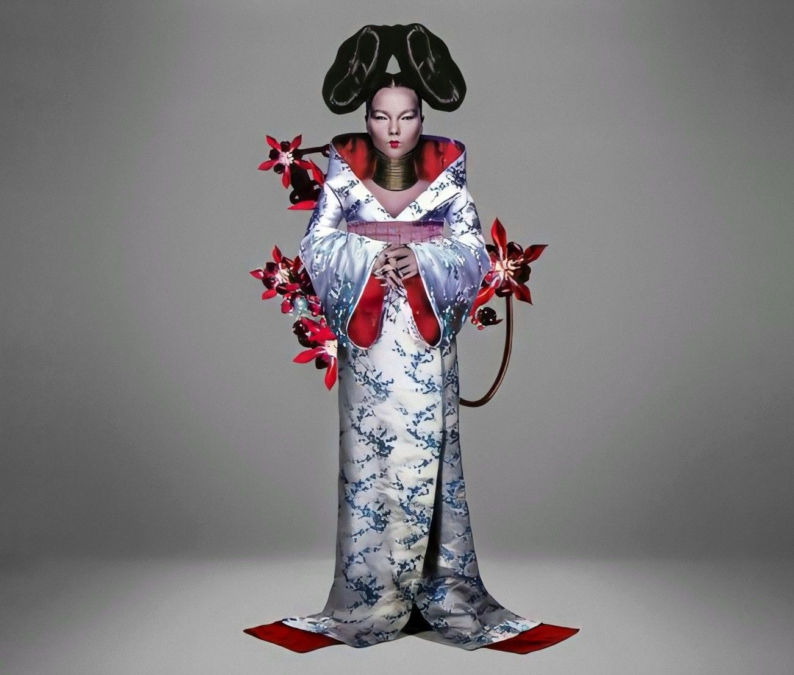

# CIS 566 Homework 3: Advanced Raymarched Scenes

Jake Lem

PennKey: jakelem

Live demo: https://jakelem.github.io/hw03-advanced-raymarching/

My reference images are below:

## Techniques used
- __SDF Modeling__: I used various signed distance functions with smooth union, intersection, and difference functions to create the base model. I used the absolute value of the query point's x value to model symmetric features such as the eyes and hair, as well as the onion operation outlined by IQ to model hollow shapes like the sleeves. I also utilized domain distortion and displacement to model folds in clothes. Finally, I used a quadratic domain distortion to model the lips.

- __Procedural Materials__: I created different materials for the skin, hair, blue textured cloth, red textured cloth, eyes, and gold rings around the neck. Each of these materials vary in albedo, diffuse contribution, specularity, and cosine power. I assigned albedo for the face by assigning specific points for regions such as the cheeks, and then and mixing colors based on the falloff distance from these points. I created more detailed albedo textures for the other materials, described directly below.

- __Textures and Normal Maps__: I created procedural 2D textures for the dress, hair, and belt and mapped them onto the model. To apply UVs to the surface, I divided the scene domain into several cells along the y axis, and then determined the angles of each intersection point from the corner of each cell. I then used these angles and the y-coordinates within the cell as uv coordinates, essentially projecting UVs on a cylinder about the y axis. The blue dress plant texture is animated using 2D SDFs in order to create rotating flowers and boxes distorted with FBM. I also created height maps for each of these textures and calculated the gradient to create normal maps, then applied these to the model using the Tangent/Bitangent/Normal matrix. Most of these normal maps were derived using  biased sin patterns, FBM noise, and 2D SDF distances.

- __Lighting and Shadows__: I utilized three point lights and a blue fill light to color the scene, along with soft shadows as per the instructions.

## Sources
- Calculating normals for a 2D height field: https://stackoverflow.com/questions/34644101/calculate-surface-normals-from-depth-image-using-neighboring-pixels-cross-produc
- 2D Signed Distance Functions: https://www.iquilezles.org/www/articles/distfunctions2d/distfunctions2d.htm
- 3D Signed Distance Functions: https://www.iquilezles.org/www/articles/distfunctions/distfunctions.htm

## Objective
- Gain experience with signed distance functions
- Experiment with animation curves
- Create a presentable portfolio piece

## Base Code

You will copy your implementation of hw02 into your hw03 repository.

## Assignment Requirements
- __(35 points) Artwork Replication__ Your raymarched scene should attempt to replicate the appearance of your inspiration (include picture) with clear effort put into the replication.
- __(25 points) Materials__ Your scene should be composed of at least three different materials. We define a material to be a surface reflection model combined with some base surface color; texturing is optional.
- __(10 points) Lighting and Shadows__ Light your scene with at least three light sources. At least one of your light sources must cast shadows, and they should be soft shadows using the penumbra shadows algorithm we discussed in class. Consider following the "Key Light, Fill Light, GI Light" formulation from the in-class example.
- __(20 points) Performance__ The frame rate of your scene must be at least 10FPS.
- __(10 points)__ Following the specifications listed
[here](https://github.com/pjcozzi/Articles/blob/master/CIS565/GitHubRepo/README.md),
create your own README.md, renaming this file to INSTRUCTIONS.md. Don't worry
about discussing runtime optimization for this project. Make sure your
README contains the following information:
  - Your name and PennKey
  - Citation of any external resources you found helpful when implementing this
  assignment.
  - A link to your live github.io demo
  - An explanation of the techniques you used to model and animate your scene.

## Useful Links
- [IQ's Article on SDFs](http://www.iquilezles.org/www/articles/distfunctions/distfunctions.htm)
- [IQ's Article on Smooth Blending](http://www.iquilezles.org/www/articles/smin/smin.htm)
- [IQ's Article on Useful Functions](http://www.iquilezles.org/www/articles/functions/functions.htm)
- [Breakdown of Rendering an SDF Scene](http://www.iquilezles.org/www/material/nvscene2008/rwwtt.pdf)

## Submission
Commit and push to Github, then make a pull request on the hw03 repository with a title containing your name, and a comment containing a link to your live demo.

## Inspiration
- [Alien Corridor](https://www.shadertoy.com/view/4slyRs)
- [The Evolution of Motion](https://www.shadertoy.com/view/XlfGzH)
- [Fractal Land](https://www.shadertoy.com/view/XsBXWt)
- [Voxel Edges](https://www.shadertoy.com/view/4dfGzs)
- [Snail](https://www.shadertoy.com/view/ld3Gz2)
- [Cubescape](https://www.shadertoy.com/view/Msl3Rr)
- [Journey Tribute](https://www.shadertoy.com/view/ldlcRf)
- [Stormy Landscape](https://www.shadertoy.com/view/4ts3z2)
- [Generators](https://www.shadertoy.com/view/Xtf3Rn)
