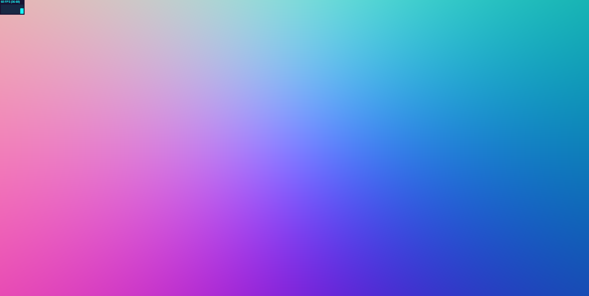

# CIS 566 Homework 2: Implicit Surfaces

## Submission

- Inspiration pic

- My interpretation
 

### Helpful links:
- https://www.iquilezles.org/www/articles/distfunctions/distfunctions.htm
- https://iquilezles.org/www/articles/warp/warp.htm
- https://www.shadertoy.com/view/wl3czM
- All of Adam's shader toys :) 

### SDFs and animation

- **Tower** - Smoothblended a series of capped cylinders for the tower neck, and roof. The tower also has wooden details which are created using boxes and toruses. The SDFs query point's are transformed and rotated to be placed into the scene. 
- **Background and Foreground** - The background was created with a large sdBox, with several cylinders smoothSubtracted from the center, and smoothUnioned on the sides. This is  to mimic the depth and cave like rocks in the original image. fbm noise is used to add texture.
- **Birds** - Birds are composed of ellipsoid bodies and wings. The body is translated in the x and y direction over time, where the y direction is manipulated via a bias and sin function. The wings are made to flap in a range of [-30, 30] degrees. 

### Materials 
The materials in the scene utilise lambert shading with various colours and noise functions to add texturing/colour. 
- **Tower** - lambert shading
- **Tower Details** - Wood texturing using @dean_the_coder's shader toy linked above
- **Background** - lambert + blinn phong + fbm colour
- **Grass** - gbm for colouring

### Lighting and shadows
There are 4 lights in the scene: key light, fill light, ambient light, and foggy light. The foggy light is an attempt to make the background slightly more purple than the foreground. 

### Frame rate
I used the techniques discussed in lecture to increase the frame rate! The bounding boxes helped the most; I put bounding boxes around my tower, the roof/detail area, the background, foreground, and each bird. I also added a MAX_RAY_Z. 

## Objective
- Gain experience with signed distance functions
- Experiment with animation curves

## Base Code

Please feel free to use this code as a base (https://www.shadertoy.com/view/fsdXzM)

The code we have provided for this assignment features the following:
- A square that spans the range [-1, 1] in X and Y that is rendered with a
shader that does not apply a projection matrix to it, thus rendering it as the
entirety of your screen
- TypeScript code just like the code in homework 1 to set up a WebGL framework
- Code that passes certain camera attributes (listed in the next section),
the screen dimensions, and a time counter to the shader program.

## Assignment Requirements
- __(10 points)__ Modify the provided `flat-frag.glsl` to cast rays from a
virtual camera. We have set up uniform variables in your shader that take in
the eye position, reference point position, and up vector of the `Camera` in
the provided TypeScript code, along with a uniform that stores the screen width
and height. Using these uniform variables, and only these uniform variables,
you must write a function that uses the NDC coordinates of the current fragment
(i.e. its fs_Pos value) and projects a ray from that pixel. Refer to the [slides
on ray casting](https://docs.google.com/presentation/d/e/2PACX-1vSN5ntJISgdOXOSNyoHimSVKblnPnL-Nywd6aRPI-XPucX9CeqzIEGTjFTwvmjYUgCglTqgvyP1CpxZ/pub?start=false&loop=false&delayms=60000&slide=id.g27215b64c6_0_107)
from CIS 560 for reference on how to cast a ray without an explicit
view-projection matrix. You'll have to compute your camera's Right vector based
on the provided Up vector, Eye point, and Ref point. You can test your ray
casting function by converting your ray directions to colors using the formula
`color = 0.5 * (dir + vec3(1.0, 1.0, 1.0))`. If your screen looks like the
following image, your rays are being cast correctly:

- __(70 points)__ Create a scene using raymarched signed distance functions.
The subject of your scene should be based on some reference image, such as a
shot from a movie or a piece of artwork. Your scene should incorporate the
following elements:
  - The SDF combination operation Smooth Blend.
  - Basic Lambertian reflection using a hard-coded light source and SDF surface normals.
  - Animation of at least one element of the scene, with at least two Toolbox Functions
  used to control the animation(s).
  - Hard-edged shadows cast by shapes in the scene onto one another using a shadow-feeler ray.

For the next assignment you will build upon this scene with procedural textures and more
advanced lighting and reflection models, so don't worry if your scene looks a bit drab
given the requirements listed above.

- __(10 points)__ Following the specifications listed
[here](https://github.com/pjcozzi/Articles/blob/master/CIS565/GitHubRepo/README.md),
create your own README.md, renaming this file to INSTRUCTIONS.md. Don't worry
about discussing runtime optimization for this project. Make sure your
README contains the following information:
  - Your name and PennKey
  - Citation of any external resources you found helpful when implementing this
  assignment.
  - A link to your live github.io demo (refer to the pinned Piazza post on
    how to make a live demo through github.io)
  - An explanation of the techniques you used to model and animate your scene.

## Useful Links
- [IQ's Article on SDFs](http://www.iquilezles.org/www/articles/distfunctions/distfunctions.htm)
- [IQ's Article on Smooth Blending](http://www.iquilezles.org/www/articles/smin/smin.htm)
- [IQ's Article on Useful Functions](http://www.iquilezles.org/www/articles/functions/functions.htm)
- [Breakdown of Rendering an SDF Scene](http://www.iquilezles.org/www/material/nvscene2008/rwwtt.pdf)

## Submission
Commit and push to Github, then submit a link to your commit on Canvas. Remember
to make your own README!

## Inspiration
- [Alien Corridor](https://www.shadertoy.com/view/4slyRs)
- [The Evolution of Motion](https://www.shadertoy.com/view/XlfGzH)
- [Fractal Land](https://www.shadertoy.com/view/XsBXWt)
- [Voxel Edges](https://www.shadertoy.com/view/4dfGzs)
- [Snail](https://www.shadertoy.com/view/ld3Gz2)
- [Cubescape](https://www.shadertoy.com/view/Msl3Rr)
- [Journey Tribute](https://www.shadertoy.com/view/ldlcRf)
- [Stormy Landscape](https://www.shadertoy.com/view/4ts3z2)
- [Generators](https://www.shadertoy.com/view/Xtf3Rn)
