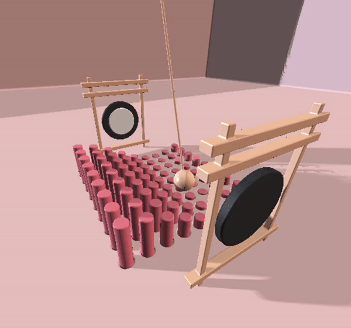

# CIS 566 Homework 3: Advanced Raymarch Scenes
Name : Samantha Lee
PennKey : smlee18

Live Demo: https://18smlee.github.io/hw03-advanced-raymarching/

## Inspiration
I really liked the look of the 3D rendered satisfying videos - so I took inspiration from one I found online!

Inspiration: https://www.youtube.com/watch?t=596&fbclid=IwAR1bL0yg79VJTeRl3MopTtCPIDUA2mSWdGRWKI08Wkx3qX8kYcUEaylCWIo&v=zlZR8nePEOY&feature=youtu.be&ab_channel=PratulDesigns

## Object Construction
To create the repeated cylinders, I performed an opRepLim function on the position of a single cylinder. Then I smooth subtracted it from the floor to create divets, then created the same cylinders with a slightly smaller radius that come out of the floor. The pendulum is created from an elongated capsule smooth blended with a sphere. The gongs are made with two cylinders and the beams are made with horizontal and vertical rounded boxes.

Each object is assigned a material with a color, specular, and shininess value. To more closely resemble the inspiration photo, I made the pendulum shiny, the cylinders semi glossy, and the floor matte. 

## Animation
To create the wave look of the cylinders, I applied a step function into a cosine function. I determined the step length using the x value of the repeating position and the cylinder's radius. Then I translated the wave over a period of time. To sync up the animation of the pendulum and the cylinder wave, I applied the same frequency to the horizontal translation of the pendulum. To give the pendulum a swinging feeling vertically, I applied a smoothstep pulsing function to the y coordinate with half of the frequency of the horizontal translation's wave.
