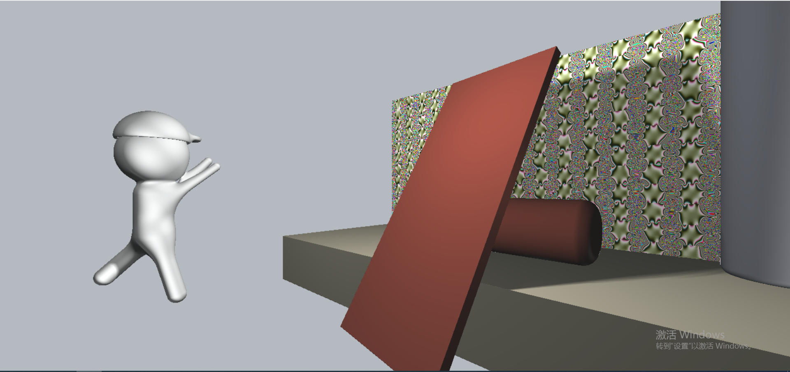
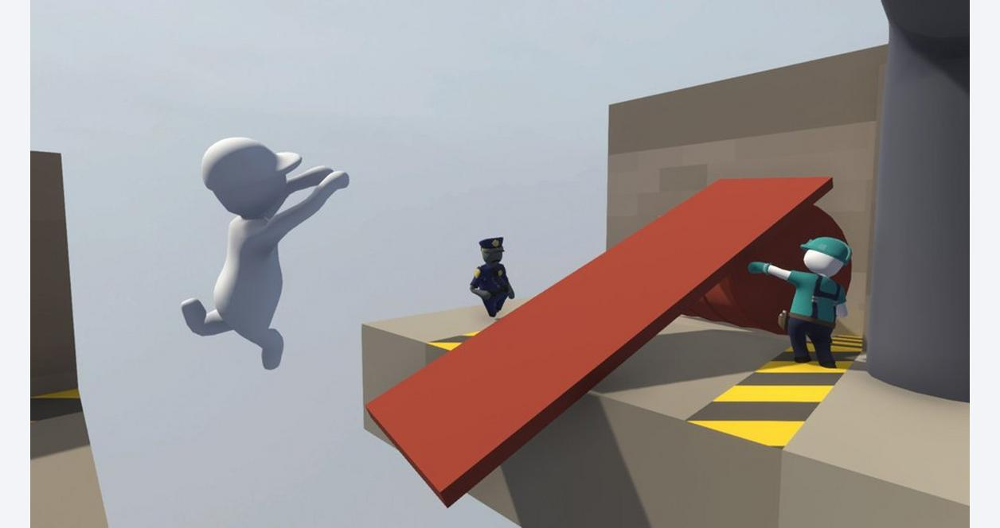

Name: Haowei Li\
Pennkey: lihaowei

## Live Demo

## External Resources
https://www.iquilezles.org/www/articles/distfunctions/distfunctions.htm

## Techniques used
- I used Smooth Blend Subtraction in modeling the cap of the character.
- I used Smooth Blend Union in modeling the other parts of the character.
- I used bias and sin toolbox functions to rotate the bridge back and forth over time.
- I used sin and cos functions along with the perlin noise function to create the material of the backwall.
- I used lambert reflection model for the material of the ground and the bridge.
- I used Blinn-Phong reflection model for the material of the cylinders and the white character.
- There are three light sources in my scene: a key light that cast shadow which acts as a sun, a fill light that light up the shadow to make it not so dark, and a GI light that acts as the global illumination start from the skylight, which is a little bit blue-ish.

## Pictures
Screenshot

Reference Image

