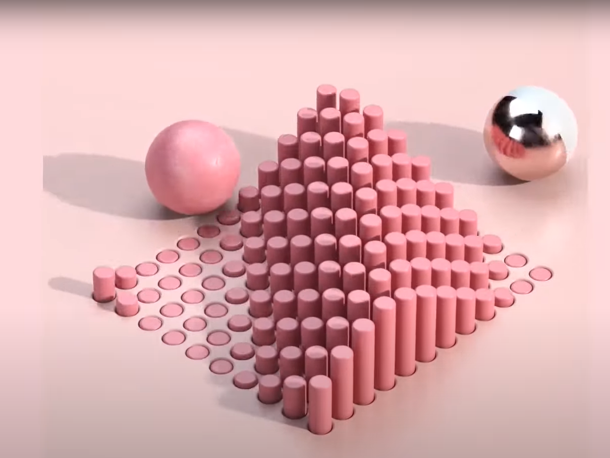

# CIS 566 Homework 3: Advanced Raymarch Scenes
Name : Samantha Lee
PennKey : smlee18

Live Demo: https://18smlee.github.io/hw03-advanced-raymarching/

## Inspiration
I really liked the look of the 3D rendered satisfying videos - so I took inspiration from one I found online!

Inspiration: https://www.youtube.com/watch?t=596&fbclid=IwAR1bL0yg79VJTeRl3MopTtCPIDUA2mSWdGRWKI08Wkx3qX8kYcUEaylCWIo&v=zlZR8nePEOY&feature=youtu.be&ab_channel=PratulDesigns

## Cylinders
- Performed opRepLim on a block of cylinders and smooth subtracted them from the floor plane
- Did the same function on a block of cylinders with a slightly smaller radius to give the illusion that they are coming in and out of the floor
- Applied a cosine function to the cylinder heights and floored the input in order to keep the cylinder tops unwarped

## Pendulum
- Smooth blended a sphere and a rod together to create a pendulum
- Applied a smoothstep pulsing function to the y coordinate of the pendulum and a cos to the z coordinate to create a swinging motion
