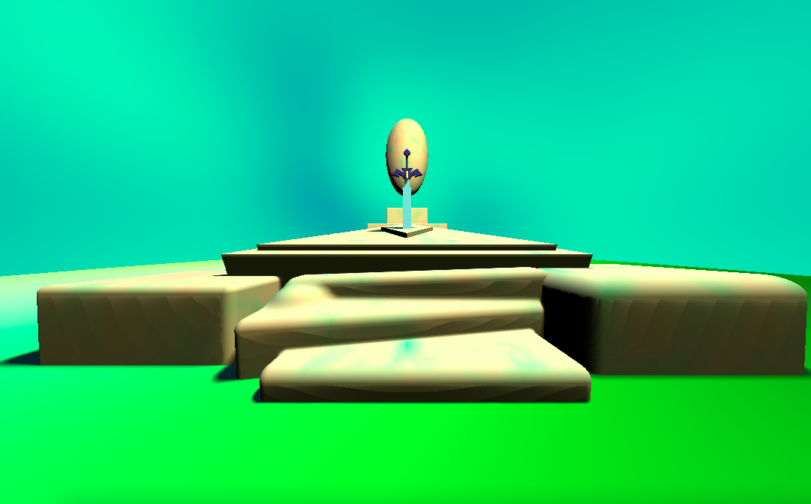
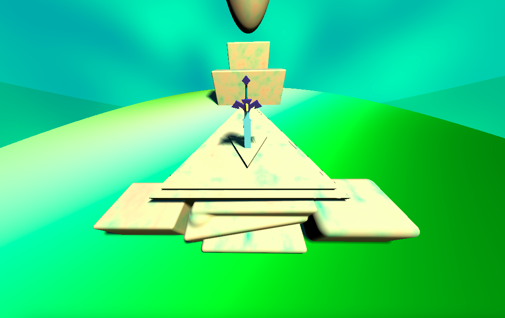
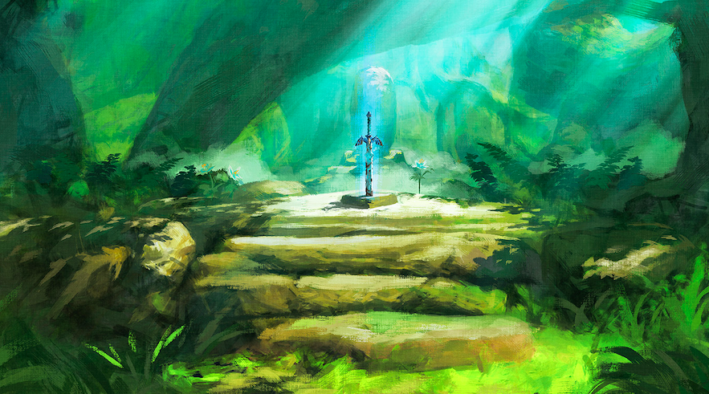

# CIS 566 Homework 3: Advanced Raymarched Scenes

## Live Demo: https://eddieh80.github.io/hw03-advanced-raymarching/

## Screenshots:

## Reference:

## Description:

I added in some more geometry to the sword to make it look a bit better, using the SDFs for a box, capsule, and triangular prism. To color in the material for the podium/stairs, I fed FBM into a cosine color palette and used lambertian shading. To color in the floor of the scene, I fed Perlin Noise into a different cosine color palette. To color in the blade and yellow gem of the sword, I added in some Blinn-Phong shading and for the rest of the elements in the scene I used basic lambert shading. I once again fed Perlin Noise into a cosine color palette to color in the background, except this time I multiplied in the cosine of u_Time to add some animation.

For lighting I have a main key light that is used to create the soft shadows of the scene, and then I also used a fill light with a blueish green color to help illuminate the shadows a bit. I also added in a conditional to make this fill light more apparent on the blade of the sword so that it pops out more. I also used a global illumination light that contributes some yellow lighting to all elements in the scene, and added another conditional to increase the effect of this light on the yellow gem of the sword to make it more vibrant.

To help optimize the performance of my scene, I added in a max ray length to terminate the ray marching process early if needed and I also added in a bounding sphere check to help reduce computations when checking the SDFs of the scene. The overall FPS of my scene is still pretty bad though.

## External Sources:

https://www.shadertoy.com/view/ssdSR2

https://www.shadertoy.com/view/7stSW7

https://www.iquilezles.org/www/articles/distfunctions/distfunctions.htm

## Objective
- Gain experience with signed distance functions
- Experiment with animation curves
- Create a presentable portfolio piece

## Submission
Commit and push to Github, then make a pull request on the hw03 repository with a title containing your name, and a comment containing a link to your live demo.

## Inspiration
- [Alien Corridor](https://www.shadertoy.com/view/4slyRs)
- [The Evolution of Motion](https://www.shadertoy.com/view/XlfGzH)
- [Fractal Land](https://www.shadertoy.com/view/XsBXWt)
- [Voxel Edges](https://www.shadertoy.com/view/4dfGzs)
- [Snail](https://www.shadertoy.com/view/ld3Gz2)
- [Cubescape](https://www.shadertoy.com/view/Msl3Rr)
- [Journey Tribute](https://www.shadertoy.com/view/ldlcRf)
- [Stormy Landscape](https://www.shadertoy.com/view/4ts3z2)
- [Generators](https://www.shadertoy.com/view/Xtf3Rn)
