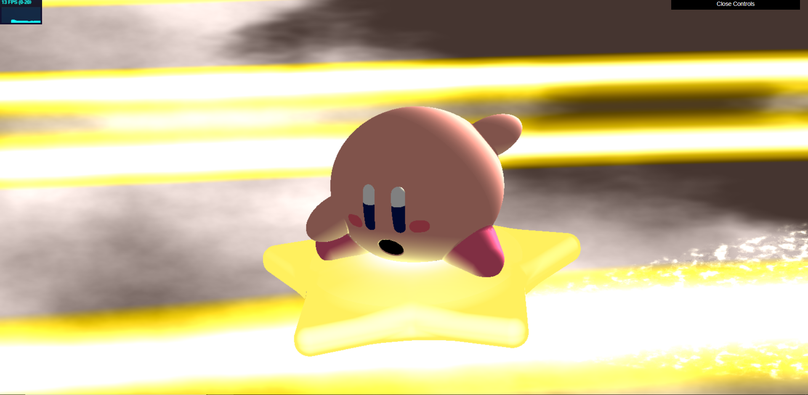

# Ruth Chung

## Pennkey: 33615194

## link to scene
[https://ruthchu.github.io/hw03-advanced-raymarching/](https://ruthchu.github.io/hw03-advanced-raymarching/)

decided to make kirby riding a star. inspiration taken from a scene in the [Smash Ultimate trailer](https://youtu.be/WShCN-AYHqA)

screenshot of scene (no good static images unfortunately, so have a blurry screenshot):

## static image!

gif to see the animation

## materials/techniques used
kirby
- body
  - made of a mix of sphere's, ellipsoids, and roundcones
  - flat color with ambient light term added
  - soft shadows applied
  - specular term used to make the glow where kirby sits on the star
- eyes
  - blinn phong specular applied to eyes
  - eyes made by using sdf subtraction to determine the COLOR boundaries
- mouth
  - sdf subtraction
- cheeks
  - used ellipsoid sdf to determine COLOR boundary only
- animation
  - animated using gain and bias to approximate an elastic bounce
  - all elements on kirby are modified by the same animation term
  - the way the sdf is constructed follows a scene graph, where the body is the root and everything else is a node from it (including the star)

star
- subsurface scattering on the star to make it appear as if glowing
- specular term applied where kirby sits on the star to add to the glowing effect

background (flat)
- fbm clouds
- sine/cosine functions used to determine the boundary of the light beams and make the light beams travel across the back
- cone of white speckles made using fbm noise trailing behind kirby (tried to replicate sparkles, didn't go so well)

## lighting
- ambient light on kirby
- point light to represent star glow
- point light from behind kirby to represent glowing light reflecting off back
- light from below for subsurface scattering on star

## useful external resources
- referenced the heck out of this page:
[https://www.iquilezles.org/www/articles/distfunctions/distfunctions.htm](https://www.iquilezles.org/www/articles/distfunctions/distfunctions.htm)